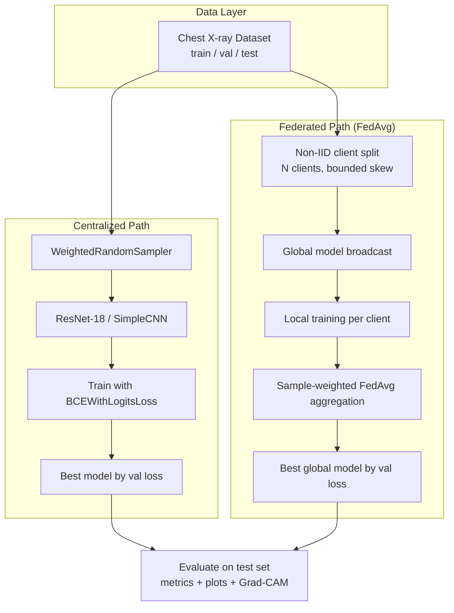

<div align="center">

# Chest X-ray Pneumonia Classification

**Centralized learning vs. federated learning (FedAvg) in PyTorch**

[](https://github.com/isaac-sun/chest-xray-federated-learning/actions/workflows/ci.yml)
[](LICENSE)
[](https://www.python.org/)
[](https://pytorch.org/)
[](https://github.com/astral-sh/ruff)

<sub>中文文档 → [README_ZH.md](README_ZH.md)</sub>

</div>

A complete, reproducible PyTorch experiment that compares **centralized deep learning** with **federated learning (FedAvg)** for binary pneumonia classification on chest X-ray images. The pipeline covers data loading, non-IID client simulation, model training, full evaluation, visualization, and Grad-CAM explainability.

---

## Table of Contents

- [Overview](#overview)
- [Features](#features)
- [Pipeline](#pipeline)
- [Project Structure](#project-structure)
- [Installation](#installation)
- [Dataset](#dataset)
- [Usage](#usage)
- [Configuration](#configuration)
- [Methodology](#methodology)
- [Results](#results)
- [Explainability (Grad-CAM)](#explainability-grad-cam)
- [Reproducibility](#reproducibility)
- [Module Reference](#module-reference)
- [Development](#development)
- [Citation](#citation)
- [License](#license)

---

## Overview

Pneumonia is a leading cause of mortality worldwide, and chest X-ray imaging is a primary diagnostic tool. In real healthcare settings, patient data is distributed across hospitals and **cannot be centralized** due to privacy regulations. This project explores two paradigms side by side:

1. **Centralized training** — all data is pooled in one place (the classical baseline).
2. **Federated training (FedAvg)** — data stays on simulated non-IID hospital clients; only model weights are aggregated by a central server.

Both approaches use the same architecture (`ResNet-18` by default) and are evaluated on the same held-out test set, so the comparison is apples-to-apples.

---

## Features

- **Two training paradigms** — centralized baseline + FedAvg federated learning
- **Non-IID client simulation** — configurable class-ratio skew across clients, with bounded, sample-conservative splits that avoid single-class collapse
- **Class-imbalance handling** — `BCEWithLogitsLoss(pos_weight=...)` + optional `WeightedRandomSampler` for centralized training
- **Full evaluation suite** — accuracy, precision, recall, F1, confusion matrix, ROC-AUC
- **Rich visualizations** — loss/accuracy curves, confusion matrices, ROC curves, metric bar charts, sample prediction panels
- **Explainability** — Grad-CAM heatmaps highlighting diagnostic regions
- **Reproducible** — global seed for Python / NumPy / PyTorch + cuDNN deterministic mode
- **Single-file config** — everything tunable from `configs/config.yaml`
- **Installable package** — `pip install -e .` gives you the `xray-fl` CLI, a test suite, and CI

---

## Pipeline



---

## Project Structure

```text
.
├── configs/
│   └── config.yaml              # Single source of truth for all hyperparameters
├── docs/
│   └── images/                  # Figures embedded in this README
├── results/                     # Committed metrics JSON + training histories
├── src/
│   └── xray_fl/                 # Installable package
│       ├── __init__.py
│       ├── __main__.py          # python -m xray_fl
│       ├── cli.py               # xray-fl command dispatcher
│       ├── config.py            # Config loading + project-root resolution
│       ├── data.py              # Datasets, transforms, non-IID client split
│       ├── model.py             # SimpleCNN + ResNet-18 builders, Grad-CAM target layer
│       ├── federated.py         # FederatedClient + sample-weighted FedAvg
│       ├── train_centralized.py # Centralized training entry point
│       ├── train_federated.py   # FedAvg federated training entry point
│       ├── evaluate.py          # Metrics, plots, Grad-CAM, standalone evaluation
│       └── utils.py             # Seed, device, IO, metric helpers
├── tests/                       # pytest suite (no dataset required)
├── outputs/                     # Generated locally: checkpoints + figures (gitignored)
├── data/                        # Dataset (NOT tracked — provide your own)
├── .github/workflows/ci.yml     # Lint + tests on Python 3.10 and 3.12
├── CHANGELOG.md                 # Development log
├── CITATION.cff
├── CONTRIBUTING.md
├── LICENSE
├── Makefile                     # install / lint / test / train / figures / clean
├── pyproject.toml               # Dependencies, CLI entry point, tool config
├── requirements.txt             # Thin wrapper around `pyproject.toml`
└── README.md / README_ZH.md
```

---

## Installation

**Python 3.10+** is required. Anaconda and `venv` both work.

```bash
git clone https://github.com/isaac-sun/chest-xray-federated-learning.git
cd chest-xray-federated-learning

# Option A — venv
python3.10 -m venv .venv
source .venv/bin/activate
pip install -e .

# Option B — conda
conda create -n xray-fl python=3.10
conda activate xray-fl
pip install -e .
```

`pip install -r requirements.txt` also works — it simply defers to `pyproject.toml`.

For development (tests + lint):

```bash
pip install -e ".[dev]"
```

> **Note:** For GPU support, install the PyTorch build matching your CUDA version from [pytorch.org](https://pytorch.org/get-started/locally/). CPU and Apple Silicon (MPS) are auto-detected and supported.

---

## Dataset

This repository does **not** include the dataset. We use the publicly available chest X-ray pneumonia dataset from Kermany et al. (2018):

- **Source:** [Chest X-Ray Images (Pneumonia) on Kaggle](https://www.kaggle.com/datasets/paultimothymooney/chest-xray-pneumonia)
- **Reference:** Kermany et al., *Identifying Medical Diagnoses and Treatable Diseases by Image-Based Deep Learning*, Cell, 2018.

Download and organize it in `ImageFolder` format:

```text
data/
├── train/
│   ├── NORMAL/      # 1,341 images
│   └── PNEUMONIA/   # 3,875 images
├── val/
│   ├── NORMAL/      # 8 images
│   └── PNEUMONIA/   # 8 images
└── test/
    ├── NORMAL/      # 234 images
    └── PNEUMONIA/   # 390 images
```

> The dataset is class-imbalanced (~3:1 PNEUMONIA:NORMAL in train), which this project explicitly addresses via `pos_weight` and weighted sampling.

---

## Usage

Three commands cover the whole workflow. Paths inside `configs/config.yaml` are resolved relative to the repository root, so you can run them from anywhere:

```bash
# 1. Train the centralized baseline (saves model + metrics + figures)
xray-fl train-centralized

# 2. Train the federated model (auto-detects the centralized model for comparison plots)
xray-fl train-federated

# 3. (Optional) Re-evaluate saved checkpoints and regenerate all figures
xray-fl evaluate
```

Equivalent invocations:

```bash
python -m xray_fl train-centralized
xray-fl train-centralized --config configs/config.yaml   # explicit config path
make train                                               # convenience targets
```

| Artifact | Location | Tracked |
| --- | --- | --- |
| Model checkpoints | `outputs/models/` | no |
| Figures | `outputs/plots/` | no |
| Metrics JSON + training histories | `results/` | yes |
| README figures | `docs/images/` | yes |

Refresh the README figures after a run with `make figures`.

---

## Configuration

Everything is controlled via [`configs/config.yaml`](configs/config.yaml):

| Section | Key Fields | Description |
|---------|-----------|-------------|
| `seed` | `42` | Global random seed |
| `data` | `image_size`, `num_workers`, `normalize_mean/std` | Input preprocessing |
| `model` | `name: resnet18` (`simple_cnn` also supported), `pretrained` | Model selection |
| `training` | `batch_size`, `epochs`, `learning_rate`, `weight_decay`, `use_weighted_sampler` | Centralized hyperparams |
| `federated` | `num_clients`, `rounds`, `local_epochs`, `client_lr`, `noniid_*` | FedAvg + non-IID controls |
| `paths` | `models_dir`, `plots_dir`, `results_dir` | Output locations |

The non-IID split knobs (`noniid_ratio_span`, `noniid_min_ratio_floor`, `noniid_max_ratio_cap`, `noniid_min_samples_per_class`, `noniid_shuffle_target_ratios`) bound client class-ratio skew while guaranteeing exact sample conservation across clients.

---

## Methodology

### Centralized Training

- Loads the full `train/val/test` splits with train-time augmentation (random flip + rotation)
- Uses `WeightedRandomSampler` to balance mini-batches despite class imbalance
- Trains with `BCEWithLogitsLoss(pos_weight=num_neg/num_pos)` and Adam
- `ReduceLROnPlateau` scheduler (factor 0.5, patience 2) stabilizes optimization
- Saves the checkpoint with the lowest validation loss

### Federated Training (FedAvg)

- Splits `train` into `N` clients with **bounded non-IID label skew** (each client sees a different PNEUMONIA:NORMAL ratio, but no client collapses to a single class)
- Each round: server broadcasts the global model → each client trains locally for `E` epochs → server aggregates via **sample-size-weighted FedAvg**
- A single global `pos_weight` (computed across all client data) is passed to every client's local loss to counter imbalance
- Saves the global checkpoint with the lowest validation loss
- If a centralized model exists, automatically generates side-by-side comparison plots

---

## Results

Both models were trained with `ResNet-18` (from scratch, `seed=42`) and evaluated on the 624-image test set.

### Test-set Metrics

| Metric | Centralized | Federated (FedAvg) |
|--------|:-----------:|:------------------:|
| Accuracy | **88.62%** | 82.69% |
| Precision | **85.84%** | 78.66% |
| Recall | 97.95% | **99.23%** |
| F1 Score | **91.50%** | 87.76% |
| ROC-AUC | **0.9600** | 0.9449 |

### Confusion Matrices

| | Centralized | Federated |
|---|:---:|:---:|
| **TN / FP** | 171 / 63 | 129 / 105 |
| **FN / TP** | 8 / 382 | 3 / 387 |

**Observations:**

- The centralized model achieves higher overall accuracy and precision.
- The federated model achieves **near-perfect recall (99.23%)** — it catches almost all pneumonia cases — at the cost of more false positives. This is a clinically favorable trade-off (missing pneumonia is worse than a follow-up confirmatory scan).
- Despite non-IID client distributions, FedAvg closes most of the gap to centralized training, validating federated learning as a viable privacy-preserving alternative.

### Training Curves

<p align="center">
  
  
</p>
<p align="center"><em>Validation loss (left) and accuracy (right) — Centralized (per epoch) vs Federated (per round).</em></p>

### Metric Comparison

<p align="center">
  
</p>

### Confusion Matrices & ROC Curves

<p align="center">
  
  
</p>
<p align="center"><em>Centralized (left) and Federated (right) confusion matrices on the test set.</em></p>

<p align="center">
  
  
</p>
<p align="center"><em>ROC curves — Centralized AUC = 0.9600 (left), Federated AUC = 0.9449 (right).</em></p>

### Sample Predictions

<p align="center">
  
  
</p>
<p align="center"><em>Test-set predictions with probabilities — Centralized (left) and Federated (right).</em></p>

---

## Explainability (Grad-CAM)

Grad-CAM highlights the image regions most influential to the model's prediction, providing a sanity check that the model attends to lung opacities rather than spurious artifacts.

<p align="center">
  
  
</p>
<p align="center"><em>Grad-CAM overlays (original left, heatmap right) — Centralized (left) and Federated (right).</em></p>

---

## Reproducibility

- A global seed (`config.seed`) is applied to `random`, `numpy`, `torch`, and `torch.cuda`
- `torch.backends.cudnn.deterministic = True` and `benchmark = False` are set
- With the same config + seed + hardware, run-to-run variance is minimized
- Committed histories (`results/*_history.json`) let `xray-fl evaluate` regenerate figures without retraining; model checkpoints (`outputs/models/*.pt`) are written locally and are not tracked

---

## Module Reference

| Path | Role |
|------|------|
| `src/xray_fl/data.py` | `ImageFolder` datasets, train/eval transforms, `WeightedRandomSampler`, non-IID client split with bounded skew |
| `src/xray_fl/model.py` | `SimpleCNN`, `ResNet-18` builder with single-logit head, Grad-CAM target-layer resolver |
| `src/xray_fl/federated.py` | `FederatedClient` local training + sample-weighted `fedavg` aggregation |
| `src/xray_fl/train_centralized.py` | Centralized training loop, `pos_weight`, `ReduceLROnPlateau`, best-model tracking |
| `src/xray_fl/train_federated.py` | FedAvg orchestration, global `pos_weight`, centralized comparison |
| `src/xray_fl/evaluate.py` | Metrics, confusion matrix, ROC, bar chart, training curves, Grad-CAM, sample predictions |
| `src/xray_fl/config.py` | YAML config loading + project-root resolution |
| `src/xray_fl/cli.py` | `xray-fl` subcommand dispatcher |
| `src/xray_fl/utils.py` | Seed, device detection, IO, binary metrics |
| `configs/config.yaml` | All hyperparameters in one place |
| `results/` | Committed metrics JSON and training histories |
| `docs/images/` | Figures embedded in this README |

---

## Development

```bash
make lint    # ruff check .
make test    # pytest
```

The test suite covers the non-IID split invariants (disjoint clients, exact sample conservation, no single-class collapse), FedAvg sample-weighting, metric helpers, and config resolution — and runs without the dataset. CI runs both checks on Python 3.10 and 3.12 for every push and pull request.

See [CONTRIBUTING.md](CONTRIBUTING.md) for the full workflow and [CHANGELOG.md](CHANGELOG.md) for the development log.

---

## Citation

If you use this code or the reported results, please cite it:

```bibtex
@software{sun_chest_xray_federated_learning,
  author  = {Sun, Yinan},
  title   = {Chest X-ray Pneumonia Classification with Centralized + Federated Learning},
  year    = {2026},
  version = {0.1.0},
  url     = {https://github.com/isaac-sun/chest-xray-federated-learning},
  license = {MIT}
}
```

GitHub also renders [`CITATION.cff`](CITATION.cff), so the "Cite this repository" button works out of the box.

---

## License

This project is released under the [MIT License](LICENSE).

The chest X-ray dataset is subject to its own license terms (see the [Kaggle dataset page](https://www.kaggle.com/datasets/paultimothymooney/chest-xray-pneumonia)) and is **not** redistributed in this repository.
