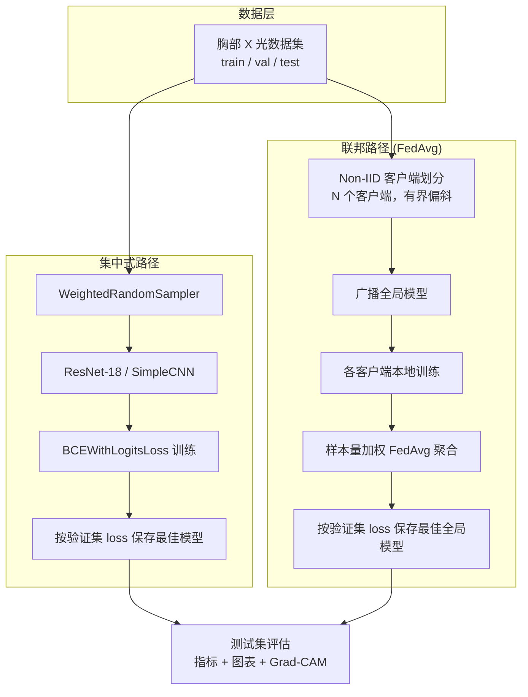

# 胸部 X 光肺炎分类（集中式学习 + 联邦学习）

[](https://www.python.org/)
[](https://pytorch.org/)
[](LICENSE)

> **English version:** [README.md](README.md)

基于 PyTorch 的完整实验项目，在胸部 X 光图像上对比 **集中式深度学习** 与 **联邦学习（FedAvg）** 两种范式进行肺炎二分类。流程涵盖数据加载、非独立同分布（Non-IID）客户端模拟、模型训练、完整评估、可视化与 Grad-CAM 可解释性分析。

---

## 目录

- [项目概述](#项目概述)
- [功能特性](#功能特性)
- [流程图](#流程图)
- [项目结构](#项目结构)
- [环境配置](#环境配置)
- [数据集](#数据集)
- [快速开始](#快速开始)
- [配置说明](#配置说明)
- [方法学](#方法学)
- [实验结果](#实验结果)
- [可解释性（Grad-CAM）](#可解释性grad-cam)
- [可复现性](#可复现性)
- [文件说明](#文件说明)
- [许可证](#许可证)

---

## 项目概述

肺炎是全球主要致死原因之一，胸部 X 光是首要影像诊断手段。在真实医疗场景中，患者数据分散在各家医院，受隐私法规限制**无法集中**。本项目并行对比两种训练范式：

1. **集中式训练** —— 所有数据汇聚于一处（经典基线）。
2. **联邦训练（FedAvg）** —— 数据保留在模拟的 Non-IID 医院客户端，仅由中央服务器聚合模型权重。

两种方式使用相同的网络架构（默认 `ResNet-18`），在同一份测试集上评估，确保公平对比。

---

## 功能特性

- **双训练范式** —— 集中式基线 + FedAvg 联邦学习
- **Non-IID 客户端模拟** —— 可配置的客户端类别比例偏斜，分裂过程有界且样本守恒，避免单类客户端塌缩
- **类别不平衡处理** —— 集中式训练使用 `BCEWithLogitsLoss(pos_weight=...)` + 可选 `WeightedRandomSampler`
- **完整评估套件** —— Accuracy、Precision、Recall、F1、混淆矩阵、ROC-AUC
- **丰富可视化** —— 损失/准确率曲线、混淆矩阵、ROC 曲线、指标柱状图、样例预测面板
- **可解释性** —— Grad-CAM 热力图，高亮诊断关注区域
- **可复现** —— 统一设置 Python / NumPy / PyTorch 随机种子 + cuDNN 确定性模式
- **单文件配置** —— 所有可调参数集中于 `configs/config.yaml`

---

## 流程图



---

## 项目结构

```text
.
├── configs/
│   └── config.yaml              # 所有超参数的唯一来源
├── src/
│   ├── data_loader.py           # 数据集加载、变换、Non-IID 划分
│   ├── model.py                 # SimpleCNN + ResNet-18 构建器、Grad-CAM 目标层
│   ├── train_centralized.py     # 集中式训练入口
│   ├── train_federated.py       # FedAvg 联邦训练入口
│   ├── client.py                # FederatedClient：本地训练逻辑
│   ├── server.py                # FedAvg 权重聚合
│   ├── evaluate.py              # 指标、绘图、Grad-CAM、独立评估
│   └── utils.py                 # 种子、配置、设备、指标辅助函数
├── outputs/                     # 生成的产物（已提交供参考）
│   ├── models/                  # 保存的检查点 (.pt)
│   ├── logs/                    # 训练历史 + 指标 (.json)
│   └── plots/                   # 所有图表 (.png)
├── data/                        # 数据集（不纳入版本管理，需自行提供）
├── .gitignore
├── LICENSE
├── MODIFICATION_LOG.md          # 开发变更日志
├── README.md                    # 英文文档
├── README_ZH.md                 # 本文件
└── requirements.txt
```

---

## 环境配置

**Python：** 推荐 3.10。Anaconda 或 venv 均可。

```bash
# 方式 A —— Anaconda
conda create -n fl_xray python=3.10
conda activate fl_xray
pip install -r requirements.txt

# 方式 B —— venv
python3.10 -m venv .venv
source .venv/bin/activate
pip install -r requirements.txt
```

`requirements.txt` 包含：`torch`、`torchvision`、`scikit-learn`、`matplotlib`、`seaborn`、`pandas`、`tqdm`、`pyyaml`、`numpy`。

> **说明：** 如需 GPU 支持，请从 [pytorch.org](https://pytorch.org/get-started/locally/) 安装与 CUDA 版本匹配的 PyTorch。项目自动检测 CPU 与 Apple Silicon（MPS）。

---

## 数据集

本仓库**不包含**数据集。使用 Kermany 等人（2018）公开发布的胸部 X 光肺炎数据集：

- **来源：** [Kaggle — Chest X-Ray Images (Pneumonia)](https://www.kaggle.com/datasets/paultimothymooney/chest-xray-pneumonia)
- **文献：** Kermany et al., *Identifying Medical Diagnoses and Treatable Diseases by Image-Based Deep Learning*, Cell, 2018.

下载后按 ImageFolder 格式整理：

```text
data/
├── train/
│   ├── NORMAL/      # 1,341 张
│   └── PNEUMONIA/   # 3,875 张
├── val/
│   ├── NORMAL/      # 8 张
│   └── PNEUMONIA/   # 8 张
└── test/
    ├── NORMAL/      # 234 张
    └── PNEUMONIA/   # 390 张
```

> 该数据集类别不平衡（训练集约 3:1 PNEUMONIA:NORMAL），本项目通过 `pos_weight` 与加权采样显式处理。

---

## 快速开始

```bash
# 1. 训练集中式基线（保存模型 + 指标 + 图表）
python src/train_centralized.py

# 2. 训练联邦模型（自动检测集中式模型以生成对比图）
python src/train_federated.py

# 3.（可选）重新评估已保存检查点并重绘所有图表
python src/evaluate.py
```

所有产物输出至 `outputs/` 目录。

---

## 配置说明

所有参数集中于 [`configs/config.yaml`](configs/config.yaml)：

| 区段 | 关键字段 | 说明 |
|------|---------|------|
| `seed` | `42` | 全局随机种子 |
| `data` | `image_size`、`num_workers`、`normalize_mean/std` | 输入预处理 |
| `model` | `name: resnet18`（也支持 `simple_cnn`）、`pretrained` | 模型选择 |
| `training` | `batch_size`、`epochs`、`learning_rate`、`weight_decay` | 集中式超参 |
| `federated` | `num_clients`、`rounds`、`local_epochs`、`client_lr`、`noniid_*` | FedAvg + Non-IID 控制 |
| `paths` | `models_dir`、`plots_dir`、`logs_dir` | 输出路径 |

Non-IID 划分旋钮（`noniid_ratio_span`、`noniid_min_ratio_floor`、`noniid_max_ratio_cap`、`noniid_min_samples_per_class`、`noniid_shuffle_target_ratios`）在保证客户端间样本精确守恒的前提下，约束类别比例偏斜范围。

---

## 方法学

### 集中式训练

- 加载完整 `train/val/test` 划分，训练时使用数据增强（随机翻转 + 旋转）
- 使用 `WeightedRandomSampler` 平衡 mini-batch 中的类别分布
- 以 `BCEWithLogitsLoss(pos_weight=num_neg/num_pos)` 与 Adam 优化
- `ReduceLROnPlateau` 调度器（factor 0.5，patience 2）稳定优化过程
- 按验证集最低 loss 保存检查点

### 联邦训练（FedAvg）

- 将 `train` 划分为 `N` 个客户端，采用**有界 Non-IID 标签偏斜**（每个客户端的 PNEUMONIA:NORMAL 比例不同，但不会塌缩为单类）
- 每轮：服务器广播全局模型 → 各客户端本地训练 `E` 个 epoch → 服务器以**样本量加权 FedAvg** 聚合
- 计算一个全局 `pos_weight`（跨所有客户端数据）传入每个客户端的本地损失函数以缓解不平衡
- 按验证集最低 loss 保存全局检查点
- 若存在集中式模型，自动生成并排对比图

---

## 实验结果

两个模型均使用 `ResNet-18`（从零训练，`seed=42`），在 624 张测试图像上评估。

### 测试集指标

| 指标 | 集中式 | 联邦（FedAvg） |
|------|:-----------:|:------------------:|
| Accuracy | **88.62%** | 82.69% |
| Precision | **85.84%** | 78.66% |
| Recall | 97.95% | **99.23%** |
| F1 | **91.50%** | 87.76% |
| ROC-AUC | **0.9600** | 0.9449 |

### 混淆矩阵

| | 集中式 | 联邦 |
|---|:---:|:---:|
| **TN / FP** | 171 / 63 | 129 / 105 |
| **FN / TP** | 8 / 382 | 3 / 387 |

**观察：**
- 集中式模型在总体准确率与精确率上更高。
- 联邦模型达到**接近完美的召回率（99.23%）**——几乎捕获所有肺炎病例——代价是更多假阳性。这在临床上是有利的权衡（漏诊肺炎比多做一次确认扫描代价更大）。
- 尽管客户端分布 Non-IID，FedAvg 仍缩小了与集中式的大部分差距，验证了联邦学习作为隐私保护替代方案的可行性。

### 训练曲线

<p align="center">
  
  
</p>
<p align="center"><em>验证集损失（左）与准确率（右）—— 集中式（按 epoch）vs 联邦（按 round）。</em></p>

### 指标对比

<p align="center">
  
</p>

### 混淆矩阵与 ROC 曲线

<p align="center">
  
  
</p>
<p align="center"><em>集中式（左）与联邦（右）在测试集上的混淆矩阵。</em></p>

<p align="center">
  
  
</p>
<p align="center"><em>ROC 曲线 —— 集中式 AUC = 0.9600（左），联邦 AUC = 0.9449（右）。</em></p>

### 样例预测

<p align="center">
  
</p>
<p align="center"><em>集中式模型在测试图像上的预测与概率。</em></p>

---

## 可解释性（Grad-CAM）

Grad-CAM 高亮对模型预测影响最大的图像区域，用于检验模型是否关注肺部病灶而非伪影。

<p align="center">
  
</p>
<p align="center"><em>集中式模型的 Grad-CAM 叠加图（左为原图，右为热力图）。</em></p>

---

## 可复现性

- 全局种子（`config.seed`）应用于 `random`、`numpy`、`torch`、`torch.cuda`
- 设置 `torch.backends.cudnn.deterministic = True`、`benchmark = False`
- 在相同配置 + 种子 + 硬件下，可最小化运行间波动
- 已保存的检查点（`outputs/models/*.pt`）与历史记录（`outputs/logs/*.json`）支持通过 `python src/evaluate.py` 免训练重新评估

---

## 文件说明

| 文件 | 职责 |
|------|------|
| `src/data_loader.py` | `ImageFolder` 数据集、训练/评估变换、`WeightedRandomSampler`、有界 Non-IID 客户端划分 |
| `src/model.py` | `SimpleCNN`、单 logit 输出的 `ResNet-18` 构建器、Grad-CAM 目标层解析 |
| `src/train_centralized.py` | 集中式训练循环、`pos_weight`、`ReduceLROnPlateau`、最佳模型追踪 |
| `src/train_federated.py` | FedAvg 编排、全局 `pos_weight`、与集中式对比 |
| `src/client.py` | `FederatedClient` —— 从广播的全局权重进行本地训练 |
| `src/server.py` | `fedavg` —— 样本量加权参数聚合 |
| `src/evaluate.py` | 指标、混淆矩阵、ROC、柱状图、训练曲线、Grad-CAM、样例预测 |
| `src/utils.py` | 种子、配置加载、设备检测、二分类指标、序列化辅助 |
| `configs/config.yaml` | 所有超参数集中管理 |
| `outputs/` | 已提交的检查点、指标 JSON 与图表供参考 |

---

## 许可证

本项目基于 [MIT 许可证](LICENSE) 发布。

胸部 X 光数据集受其自身许可条款约束（见 [Kaggle 数据集页面](https://www.kaggle.com/datasets/paultimothymooney/chest-xray-pneumonia)），本仓库**不**再分发该数据集。
