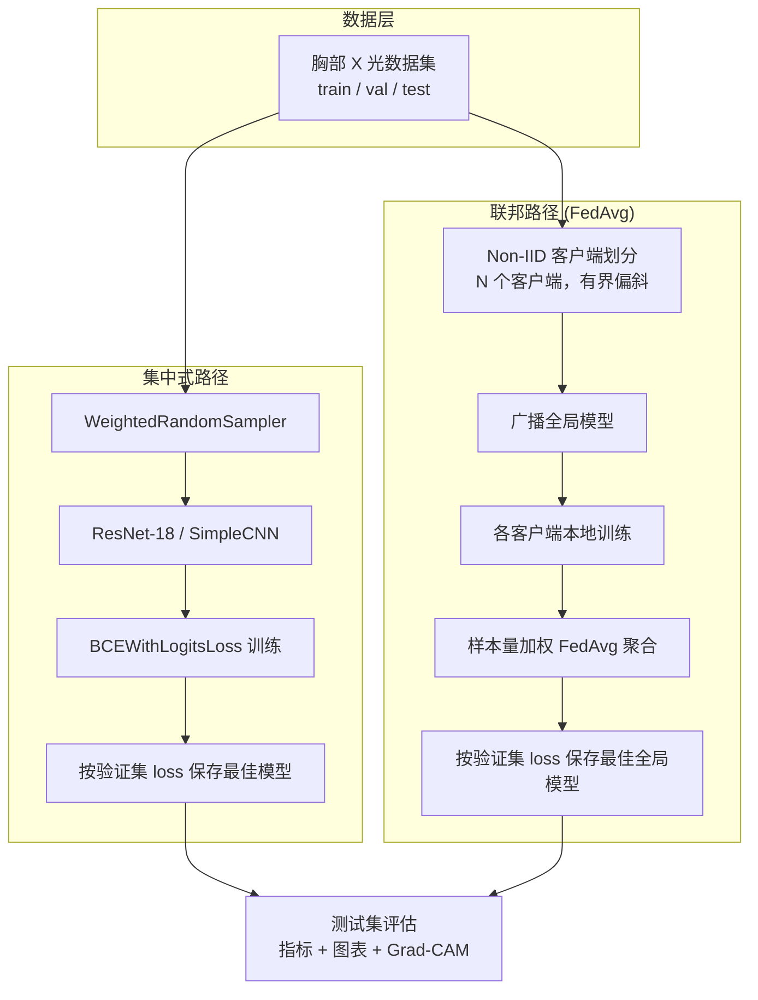
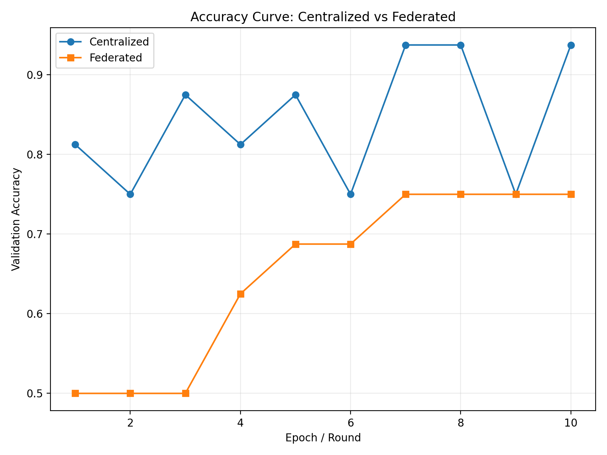
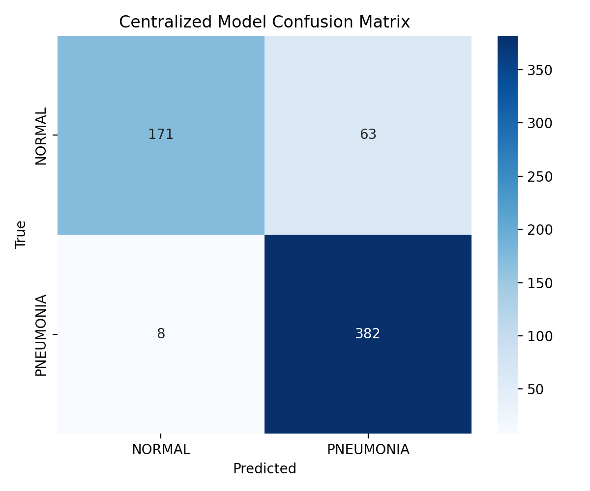
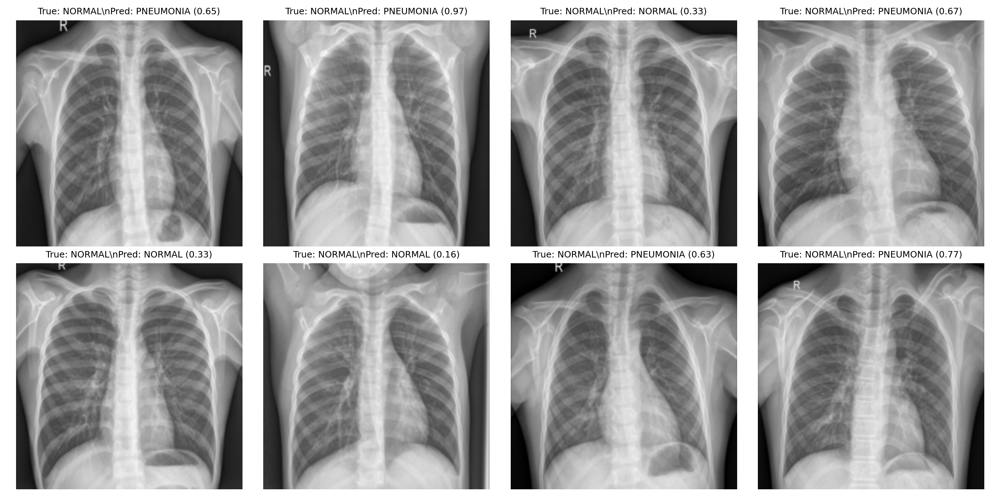
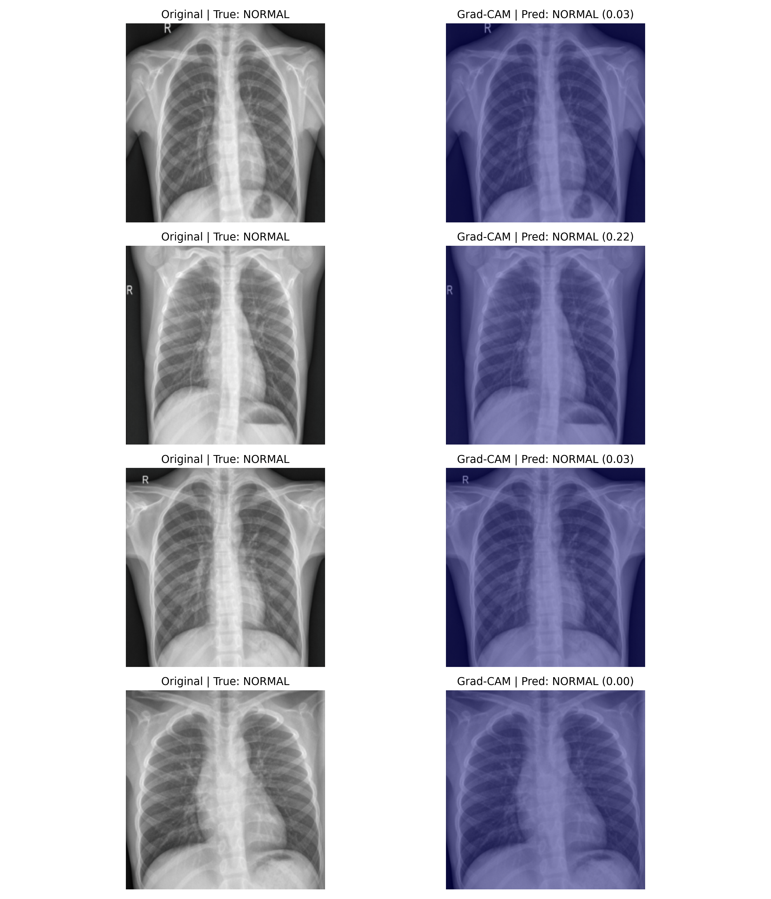
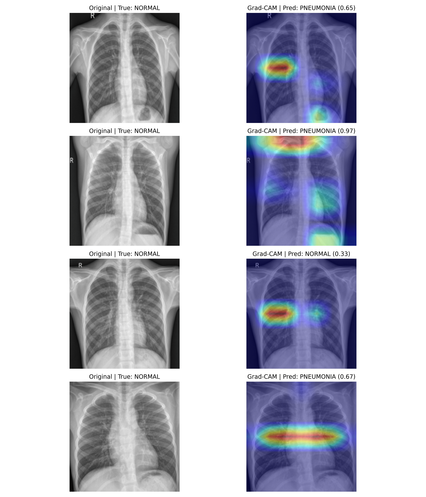

<div align="center">

# 胸部 X 光肺炎分类

**集中式学习 vs. 联邦学习（FedAvg），基于 PyTorch**

[](https://github.com/isaac-sun/chest-xray-federated-learning/actions/workflows/ci.yml)
[](LICENSE)
[](https://www.python.org/)
[](https://pytorch.org/)
[](https://github.com/astral-sh/ruff)

<sub>English → [README.md](README.md)</sub>

</div>

一个完整、可复现的 PyTorch 实验，在胸部 X 光图像上对比 **集中式深度学习** 与 **联邦学习（FedAvg）** 两种范式进行肺炎二分类。流程涵盖数据加载、非独立同分布（Non-IID）客户端模拟、模型训练、完整评估、可视化与 Grad-CAM 可解释性分析。

---

## 目录

- [项目概述](#项目概述)
- [功能特性](#功能特性)
- [流程图](#流程图)
- [项目结构](#项目结构)
- [安装](#安装)
- [数据集](#数据集)
- [使用方式](#使用方式)
- [配置说明](#配置说明)
- [方法学](#方法学)
- [实验结果](#实验结果)
- [可解释性（Grad-CAM）](#可解释性grad-cam)
- [可复现性](#可复现性)
- [模块说明](#模块说明)
- [开发](#开发)
- [引用](#引用)
- [许可证](#许可证)

---

## 项目概述

肺炎是全球主要致死原因之一，胸部 X 光是首要影像诊断手段。在真实医疗场景中，患者数据分散在各家医院，受隐私法规限制**无法集中**。本项目并行对比两种训练范式：

1. **集中式训练** —— 所有数据汇聚于一处（经典基线）。
2. **联邦训练（FedAvg）** —— 数据保留在模拟的 Non-IID 医院客户端，仅由中央服务器聚合模型权重。

两种方式使用相同的网络架构（默认 `ResNet-18`），在同一份测试集上评估，确保公平对比。

---

## 功能特性

- **双训练范式** —— 集中式基线 + FedAvg 联邦学习
- **Non-IID 客户端模拟** —— 可配置的客户端类别比例偏斜，分裂过程有界且样本守恒，避免单类客户端塌缩
- **类别不平衡处理** —— 集中式训练使用 `BCEWithLogitsLoss(pos_weight=...)` + 可选 `WeightedRandomSampler`
- **完整评估套件** —— Accuracy、Precision、Recall、F1、混淆矩阵、ROC-AUC
- **丰富可视化** —— 损失/准确率曲线、混淆矩阵、ROC 曲线、指标柱状图、样例预测面板
- **可解释性** —— Grad-CAM 热力图，高亮诊断关注区域
- **可复现** —— 统一设置 Python / NumPy / PyTorch 随机种子 + cuDNN 确定性模式
- **单文件配置** —— 所有可调参数集中于 `configs/config.yaml`
- **可安装包** —— `pip install -e .` 后即可使用 `xray-fl` 命令行、测试套件与 CI

---

## 流程图



---

## 项目结构

```text
.
├── configs/
│   └── config.yaml              # 所有超参数的唯一来源
├── docs/
│   └── images/                  # README 中引用的图表
├── results/                     # 提交的指标 JSON 与训练历史
├── src/
│   └── xray_fl/                 # 可安装包
│       ├── __init__.py
│       ├── __main__.py          # python -m xray_fl
│       ├── cli.py               # xray-fl 命令分发
│       ├── config.py            # 配置加载 + 项目根目录解析
│       ├── data.py              # 数据集、变换、Non-IID 客户端划分
│       ├── model.py             # SimpleCNN + ResNet-18 构建器、Grad-CAM 目标层
│       ├── federated.py         # FederatedClient + 样本量加权 FedAvg
│       ├── train_centralized.py # 集中式训练入口
│       ├── train_federated.py   # FedAvg 联邦训练入口
│       ├── evaluate.py          # 指标、绘图、Grad-CAM、独立评估
│       └── utils.py             # 种子、设备、IO、指标辅助函数
├── tests/                       # pytest 测试（无需数据集）
├── outputs/                     # 本地生成的检查点与图表（已 gitignore）
├── data/                        # 数据集（不纳入版本管理，需自行提供）
├── .github/workflows/ci.yml     # Python 3.10 / 3.12 上的 lint + 测试
├── CHANGELOG.md                 # 开发变更日志
├── CITATION.cff
├── CONTRIBUTING.md
├── LICENSE
├── Makefile                     # install / lint / test / train / figures / clean
├── pyproject.toml               # 依赖、命令行入口、工具配置
├── requirements.txt             # 指向 pyproject.toml 的薄封装
└── README.md / README_ZH.md
```

---

## 安装

需要 **Python 3.10+**，Anaconda 或 venv 均可。

```bash
git clone https://github.com/isaac-sun/chest-xray-federated-learning.git
cd chest-xray-federated-learning

# 方式 A —— venv
python3.10 -m venv .venv
source .venv/bin/activate
pip install -e .

# 方式 B —— conda
conda create -n xray-fl python=3.10
conda activate xray-fl
pip install -e .
```

`pip install -r requirements.txt` 同样可用 —— 它只是转发到 `pyproject.toml`。

开发环境（测试 + lint）：

```bash
pip install -e ".[dev]"
```

> **说明：** 如需 GPU 支持，请从 [pytorch.org](https://pytorch.org/get-started/locally/) 安装与 CUDA 版本匹配的 PyTorch。项目自动检测 CPU 与 Apple Silicon（MPS）。

---

## 数据集

本仓库**不包含**数据集。使用 Kermany 等人（2018）公开发布的胸部 X 光肺炎数据集：

- **来源：** [Kaggle — Chest X-Ray Images (Pneumonia)](https://www.kaggle.com/datasets/paultimothymooney/chest-xray-pneumonia)
- **文献：** Kermany et al., *Identifying Medical Diagnoses and Treatable Diseases by Image-Based Deep Learning*, Cell, 2018.

下载后按 `ImageFolder` 格式整理：

```text
data/
├── train/
│   ├── NORMAL/      # 1,341 张
│   └── PNEUMONIA/   # 3,875 张
├── val/
│   ├── NORMAL/      # 8 张
│   └── PNEUMONIA/   # 8 张
└── test/
    ├── NORMAL/      # 234 张
    └── PNEUMONIA/   # 390 张
```

> 该数据集类别不平衡（训练集约 3:1 PNEUMONIA:NORMAL），本项目通过 `pos_weight` 与加权采样显式处理。

---

## 使用方式

三条命令覆盖完整流程。`configs/config.yaml` 中的路径均相对仓库根目录解析，因此在任意目录下执行都可以：

```bash
# 1. 训练集中式基线（保存模型 + 指标 + 图表）
xray-fl train-centralized

# 2. 训练联邦模型（自动检测集中式模型以生成对比图）
xray-fl train-federated

# 3.（可选）重新评估已保存检查点并重绘所有图表
xray-fl evaluate
```

等价写法：

```bash
python -m xray_fl train-centralized
xray-fl train-centralized --config configs/config.yaml   # 显式指定配置
make train                                               # 便捷目标
```

| 产物 | 位置 | 是否提交 |
| --- | --- | --- |
| 模型检查点 | `outputs/models/` | 否 |
| 图表 | `outputs/plots/` | 否 |
| 指标 JSON + 训练历史 | `results/` | 是 |
| README 图表 | `docs/images/` | 是 |

运行结束后可用 `make figures` 把图表同步到 README。

---

## 配置说明

所有参数集中于 [`configs/config.yaml`](configs/config.yaml)：

| 区段 | 关键字段 | 说明 |
|------|---------|------|
| `seed` | `42` | 全局随机种子 |
| `data` | `image_size`、`num_workers`、`normalize_mean/std` | 输入预处理 |
| `model` | `name: resnet18`（也支持 `simple_cnn`）、`pretrained` | 模型选择 |
| `training` | `batch_size`、`epochs`、`learning_rate`、`weight_decay`、`use_weighted_sampler` | 集中式超参 |
| `federated` | `num_clients`、`rounds`、`local_epochs`、`client_lr`、`noniid_*` | FedAvg + Non-IID 控制 |
| `paths` | `models_dir`、`plots_dir`、`results_dir` | 输出路径 |

Non-IID 划分旋钮（`noniid_ratio_span`、`noniid_min_ratio_floor`、`noniid_max_ratio_cap`、`noniid_min_samples_per_class`、`noniid_shuffle_target_ratios`）在保证客户端间样本精确守恒的前提下，约束类别比例偏斜范围。

---

## 方法学

### 集中式训练

- 加载完整 `train/val/test` 划分，训练时使用数据增强（随机翻转 + 旋转）
- 使用 `WeightedRandomSampler` 平衡 mini-batch 中的类别分布
- 以 `BCEWithLogitsLoss(pos_weight=num_neg/num_pos)` 与 Adam 优化
- `ReduceLROnPlateau` 调度器（factor 0.5，patience 2）稳定优化过程
- 按验证集最低 loss 保存检查点

### 联邦训练（FedAvg）

- 将 `train` 划分为 `N` 个客户端，采用**有界 Non-IID 标签偏斜**（每个客户端的 PNEUMONIA:NORMAL 比例不同，但不会塌缩为单类）
- 每轮：服务器广播全局模型 → 各客户端本地训练 `E` 个 epoch → 服务器以**样本量加权 FedAvg** 聚合
- 计算一个全局 `pos_weight`（跨所有客户端数据）传入每个客户端的本地损失函数以缓解不平衡
- 按验证集最低 loss 保存全局检查点
- 若存在集中式模型，自动生成并排对比图

---

## 实验结果

两个模型均使用 `ResNet-18`（从零训练，`seed=42`），在 624 张测试图像上评估。

### 测试集指标

| 指标 | 集中式 | 联邦（FedAvg） |
|------|:-----------:|:------------------:|
| Accuracy | **88.62%** | 82.69% |
| Precision | **85.84%** | 78.66% |
| Recall | 97.95% | **99.23%** |
| F1 | **91.50%** | 87.76% |
| ROC-AUC | **0.9600** | 0.9449 |

### 混淆矩阵

| | 集中式 | 联邦 |
|---|:---:|:---:|
| **TN / FP** | 171 / 63 | 129 / 105 |
| **FN / TP** | 8 / 382 | 3 / 387 |

**观察：**

- 集中式模型在总体准确率与精确率上更高。
- 联邦模型达到**接近完美的召回率（99.23%）**——几乎捕获所有肺炎病例——代价是更多假阳性。这在临床上是有利的权衡（漏诊肺炎比多做一次确认扫描代价更大）。
- 尽管客户端分布 Non-IID，FedAvg 仍缩小了与集中式的大部分差距，验证了联邦学习作为隐私保护替代方案的可行性。

### 训练曲线

<p align="center">
  
  
</p>
<p align="center"><em>验证集损失（左）与准确率（右）—— 集中式（按 epoch）vs 联邦（按 round）。</em></p>

### 指标对比

<p align="center">
  
</p>

### 混淆矩阵与 ROC 曲线

<p align="center">
  
  
</p>
<p align="center"><em>集中式（左）与联邦（右）在测试集上的混淆矩阵。</em></p>

<p align="center">
  
  
</p>
<p align="center"><em>ROC 曲线 —— 集中式 AUC = 0.9600（左），联邦 AUC = 0.9449（右）。</em></p>

### 样例预测

<p align="center">
  
  
</p>
<p align="center"><em>测试集预测与概率 —— 集中式（左）与联邦（右）。</em></p>

---

## 可解释性（Grad-CAM）

Grad-CAM 高亮对模型预测影响最大的图像区域，用于检验模型是否关注肺部病灶而非伪影。

<p align="center">
  
  
</p>
<p align="center"><em>Grad-CAM 叠加图（左为原图，右为热力图）—— 集中式（左）与联邦（右）。</em></p>

---

## 可复现性

- 全局种子（`config.seed`）应用于 `random`、`numpy`、`torch`、`torch.cuda`
- 设置 `torch.backends.cudnn.deterministic = True`、`benchmark = False`
- 在相同配置 + 种子 + 硬件下，可最小化运行间波动
- 已提交的训练历史（`results/*_history.json`）可让 `xray-fl evaluate` 免训练重绘图表；模型检查点（`outputs/models/*.pt`）仅在本地生成，不纳入版本管理

---

## 模块说明

| 路径 | 职责 |
|------|------|
| `src/xray_fl/data.py` | `ImageFolder` 数据集、训练/评估变换、`WeightedRandomSampler`、有界 Non-IID 客户端划分 |
| `src/xray_fl/model.py` | `SimpleCNN`、单 logit 输出的 `ResNet-18` 构建器、Grad-CAM 目标层解析 |
| `src/xray_fl/federated.py` | `FederatedClient` 本地训练 + 样本量加权 `fedavg` 聚合 |
| `src/xray_fl/train_centralized.py` | 集中式训练循环、`pos_weight`、`ReduceLROnPlateau`、最佳模型追踪 |
| `src/xray_fl/train_federated.py` | FedAvg 编排、全局 `pos_weight`、与集中式对比 |
| `src/xray_fl/evaluate.py` | 指标、混淆矩阵、ROC、柱状图、训练曲线、Grad-CAM、样例预测 |
| `src/xray_fl/config.py` | YAML 配置加载 + 项目根目录解析 |
| `src/xray_fl/cli.py` | `xray-fl` 子命令分发 |
| `src/xray_fl/utils.py` | 种子、设备检测、IO、二分类指标 |
| `configs/config.yaml` | 所有超参数集中管理 |
| `results/` | 已提交的指标 JSON 与训练历史 |
| `docs/images/` | README 中引用的图表 |

---

## 开发

```bash
make lint    # ruff check .
make test    # pytest
```

测试覆盖 Non-IID 划分不变量（客户端互不重叠、样本精确守恒、不出现单类客户端）、FedAvg 样本量加权、指标辅助函数与配置解析，且**不需要数据集**。CI 在每次 push 与 PR 上以 Python 3.10 / 3.12 运行上述检查。

完整流程见 [CONTRIBUTING.md](CONTRIBUTING.md)，变更历史见 [CHANGELOG.md](CHANGELOG.md)。

---

## 引用

如果你使用了本仓库的代码或结果，请引用：

```bibtex
@software{sun_chest_xray_federated_learning,
  author  = {Sun, Yinan},
  title   = {Chest X-ray Pneumonia Classification with Centralized + Federated Learning},
  year    = {2026},
  version = {0.1.0},
  url     = {https://github.com/isaac-sun/chest-xray-federated-learning},
  license = {MIT}
}
```

GitHub 会直接渲染 [`CITATION.cff`](CITATION.cff)，"Cite this repository" 按钮开箱即用。

---

## 许可证

本项目基于 [MIT 许可证](LICENSE) 发布。

胸部 X 光数据集受其自身许可条款约束（见 [Kaggle 数据集页面](https://www.kaggle.com/datasets/paultimothymooney/chest-xray-pneumonia)），本仓库**不**再分发该数据集。
